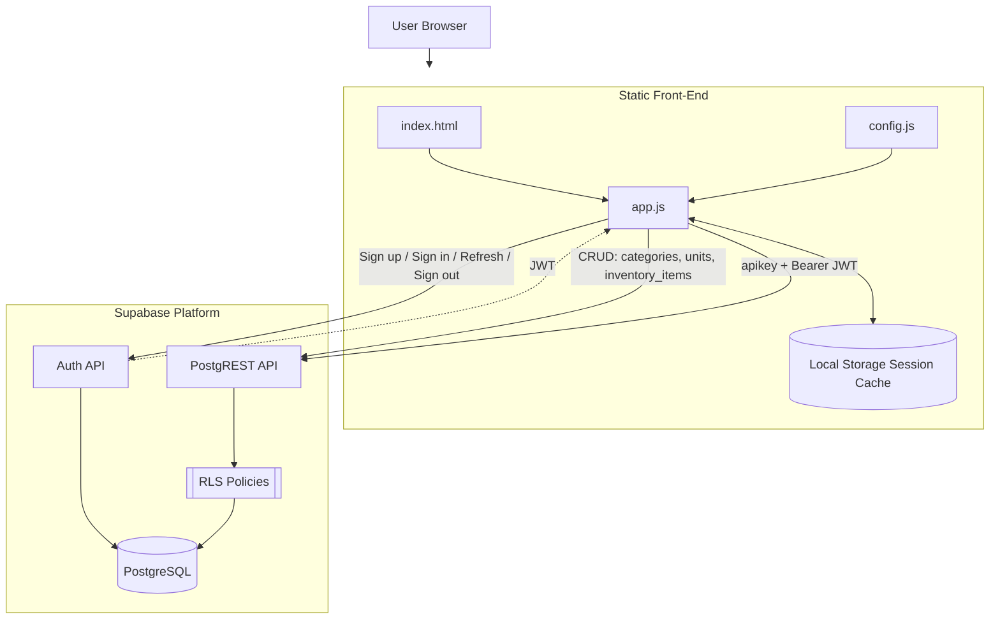

# Architecture Diagram

## Request Flow Notes

- Front-end is served as static files (`npm run start` serves `public`).
- Authentication is done directly against Supabase Auth endpoints.
- Data access is done directly against Supabase PostgREST endpoints.
- Session tokens are persisted in browser local storage and refreshed when close to expiry.
- Inventory data ownership is enforced at database level through RLS on `inventory_items`.
