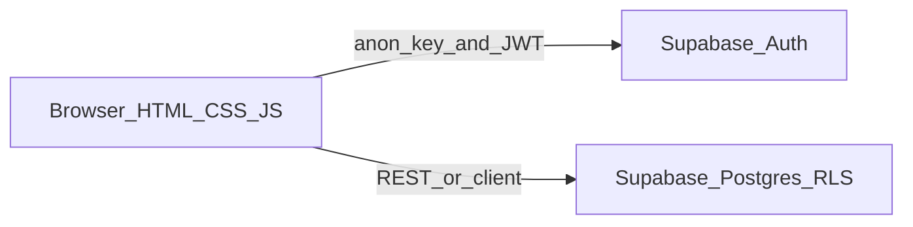

# Project specification: Product inventory web application

**Version:** 1.2  
**Backing service:** [Supabase](https://supabase.com/) (PostgreSQL, authentication, and HTTP APIs)

This document defines product goals, requirements, technology choices, and architecture for a small **product inventory** web application. **Inventory attributes** are specified in [Section 7](#7-data-model) and [Appendix A](#appendix-a-inventory-field-definitions).

---

## 1. Introduction

### 1.1 Problem statement

Individuals and small teams need a simple way to **track products** (quantities and related metadata) through a web browser, with **per-user data** and **secure sign-in**, without operating their own application server for core data access.

### 1.2 Goals

- Allow users to **register and sign in** with **email and password**.
- Provide full **CRUD** (create, read, update, delete) for inventory setup.
- Use **Supabase** as the primary backing store and API surface for authenticated data.
- Deliver a **user-friendly** interface with a **cohesive, pleasant visual theme** and clear feedback for common actions.

### 1.3 Non-goals (version 1.0)

- Native mobile applications (iOS/Android).
- Multi-warehouse or advanced supply-chain features unless added in a later revision.
- Custom username-based authentication (v1 uses **email + password** via Supabase Auth).
- Heavy front-end frameworks (React, Vue, Svelte, etc.); the client is **HTML, CSS, and JavaScript** only.

---

## 2. Users and roles

### 2.1 Authenticated user

Any user who completes sign-up and sign-in may **manage inventory records that belong to them**. All signed-in users have the same capabilities in v1 (no separate admin role unless added later).

### 2.2 Unauthenticated user

May only access **authentication-related** screens (e.g. sign in, sign up). Inventory management UI is **not available** until a valid session exists.

### 2.3 Future consideration

If **admin** vs **standard user** roles are required later, the specification should be amended with role definitions, additional RLS policies or server-side checks, and UI changes.

---

## 3. Functional requirements

| ID | Requirement |
|----|-------------|
| **FR-AUTH-01** | Users can **sign up**, **sign in**, and **sign out** using **email and password** through **Supabase Auth**. |
| **FR-AUTH-02** | The application **persists the session** in the browser (Supabase client session). Inventory features are **protected**: not shown or not functional until the user is authenticated. |
| **FR-INV-01** | Authenticated users can **create**, **list/read**, **update**, and **delete** inventory items with the attributes defined in [Appendix A](#appendix-a-inventory-field-definitions). Validation rules (required fields, ranges) follow that appendix. |
| **FR-INV-02** | **Category** is **mandatory** and must be chosen from **product categories** that describe the item’s segment (**food** or **cosmetics**) and specific category name (see `product_categories`). Free-text category entry is not allowed. **Unit of measure** is **mandatory** and must be chosen from the predefined **`units`** list (no ad-hoc unit strings). **Supplier** remains **optional free text**. |
| **FR-UI-01** | **Navigation** is obvious. **Forms** show validation and server errors clearly. **Empty**, **loading**, and **error** states are handled in the inventory views. |
| **FR-UI-02** | The UI follows a **defined theme**: consistent palette, typography, spacing, and layout. **CSS custom properties (variables)** and a small set of **design tokens** are recommended for maintainability. The theme must remain **readable** (contrast, font sizes) and **responsive** across common viewport widths. |

---

## 4. Non-functional requirements

### 4.1 Security

- Production traffic must use **HTTPS**.
- The browser application must use only the Supabase **`anon` public key**, never the **service role** key.
- **Row Level Security (RLS)** must be **enabled** on all inventory tables. Policies must ensure users can only **select, insert, update, and delete** rows where the owning user matches `auth.uid()` (or equivalent documented ownership column).
- Secrets (`SUPABASE_URL`, `SUPABASE_ANON_KEY`) must not be committed to source control in plaintext; use environment-specific configuration (see [Section 9](#9-configuration-and-secrets)).

### 4.2 Performance and reliability

- The v1 specification assumes **moderate** list sizes. **Pagination** or **“load more”** may be introduced in a later revision (e.g. v1.1) if lists grow large.

### 4.3 Accessibility

- Interactive controls must be usable with **keyboard** focus order.
- Form inputs must have **associated labels**.
- Color choices must meet **sufficient contrast** for text and critical UI affordances, consistent with the visual theme.

---

## 5. Technology specification

### 5.1 Front-end

- **HTML** for structure.
- **CSS** for layout and theming (variables/tokens encouraged).
- **JavaScript** for behavior, API calls, and DOM updates.
- **Supabase JavaScript client** (`@supabase/supabase-js`): recommended loading via **CDN** for minimal tooling, or via a small bundler if the project later standardizes on one—**CDN is the default assumption** for course-style simplicity.

### 5.2 Back-end and data layer

- **Supabase** provides:
  - **PostgreSQL** for persistent data.
  - **Supabase Auth** for identity and JWT issuance.
  - **Auto-generated HTTP API** (PostgREST) consumed by the Supabase client from the browser, subject to RLS.

No dedicated custom application server (Node, Java, etc.) is **required** for core inventory CRUD in v1, provided RLS policies correctly scope data per user.

### 5.3 Hosting

- **Static hosting** for the front-end (examples: GitHub Pages, Netlify, Vercel static export, or any static file host behind HTTPS).
- **Supabase project** hosts the database and Auth; the front-end is configured with the project URL and anon key at build or deploy time.

### 5.4 Explicitly out of scope for v1 stack

- Front-end frameworks (React, Vue, Svelte, Angular).
- A separate first-party REST/GraphQL server for inventory (unless security or policy requirements change in a future revision).

---

## 6. Architecture (high level)

The browser hosts static HTML/CSS/JS. The Supabase client uses the **anon key** and the user’s **JWT** (after sign-in) for Auth and database operations. PostgreSQL **RLS** enforces per-row access.

---

## 7. Data model

Reference data (**product categories** and **units**) is shared by all users and is maintained via **seed SQL / migrations** (or an admin workflow outside v1). Inventory rows remain **per user** via `user_id` and RLS.

### 7.1 Reference table: `product_categories`

Supports **selectable** product categories for both **food** and **cosmetics** (and similar retail segments you seed).

| Column | Type | Notes |
|--------|------|--------|
| `id` | `uuid` | Primary key; default `gen_random_uuid()`. |
| `segment` | `text` | **Required.** Constrained to distinguish catalogue groups, e.g. `food` and `cosmetics` (see Appendix A). |
| `name` | `text` | **Required.** Display name (e.g. “Dairy”, “Skincare”). |
| `sort_order` | `int` | Optional; controls dropdown/list ordering within a segment. |

### 7.2 Reference table: `units`

Predefined **units of measure** for dropdowns (e.g. each, kilogram, liter).

| Column | Type | Notes |
|--------|------|--------|
| `id` | `uuid` | Primary key; default `gen_random_uuid()`. |
| `code` | `text` | **Required**, unique. Short stable code (e.g. `ea`, `kg`, `L`). |
| `label` | `text` | **Required.** Human-readable label for the UI. |
| `sort_order` | `int` | Optional. |

### 7.3 Primary table: `inventory_items`

All rows below are scoped **per authenticated user** via `user_id` and RLS. Database column names use **snake_case**; the UI may show labels such as “Unit of Measure”.

| Logical field | Column | Type (PostgreSQL) | Notes |
|---------------|--------|-------------------|--------|
| ID | `id` | `uuid` | Primary key; default `gen_random_uuid()`. |
| *(ownership)* | `user_id` | `uuid` | **Required.** Must equal `auth.uid()` on insert; enforced by RLS. |
| Code | `code` | `text` | **Required.** Human-readable product code; **unique per user** (see Appendix A). |
| Barcode | `barcode` | `text` | Optional; **unique per user** when not null (see Appendix A). |
| Name | `name` | `text` | **Required.** |
| Category | `category_id` | `uuid` | **Required.** FK → `product_categories.id`. UI: **mandatory** `<select>` (or equivalent) populated from `product_categories`; user cannot save without a valid category. |
| Supplier | `supplier` | `text` | Optional **free text** (not a FK in v1). |
| Expiry Date | `expiry_date` | `date` | Optional; relevant for perishable goods. |
| Status | `status` | `text` | **Required** with constrained allowed values (recommended **enum** in DB—see Appendix A). |
| Cost Price | `cost_price` | `numeric(14, 4)` | Optional; must be **≥ 0** if present. |
| Selling Price | `selling_price` | `numeric(14, 4)` | Optional; must be **≥ 0** if present. |
| Quantity | `quantity` | `numeric(14, 4)` | **Required** default `0`; must be **≥ 0**. |
| Unit of Measure | `unit_id` | `uuid` | **Required.** FK → `units.id`. UI: **mandatory** `<select>` populated from `units`; users must not type arbitrary units. |
| *(audit)* | `created_at` | `timestamptz` | Default `now()`. |
| *(audit)* | `updated_at` | `timestamptz` | Default `now()`; update on row change (trigger or application). |

### 7.4 Row Level Security (conceptual)

**`inventory_items`**

- **SELECT** / **INSERT** / **UPDATE** / **DELETE**: only rows where `user_id = auth.uid()` (same rules as before).

**`product_categories` and `units` (reference data)**

- **SELECT**: allow **any authenticated** user (`auth.uid()` is not null) so the client can populate dropdowns.
- **INSERT** / **UPDATE** / **DELETE**: **not** exposed to normal users in v1—load and mutate reference rows via **SQL migrations** or **service role** tooling, not the public anon key.

Exact SQL policies belong in Supabase migrations or project documentation.

### 7.5 Optional columns (not required for v1)

These are **suggestions** if the product grows; omit them initially to keep the course project small.

| Suggestion | Rationale |
|------------|-----------|
| **`notes`** (`text`, nullable) | Free-form remarks without widening the main form. |
| **`reorder_level`** (`numeric`, nullable) | Drive “low stock” alerts or filter alongside `quantity`. |
| **`currency_code`** (`char(3)`, nullable) | Only if you sell in multiple currencies; otherwise assume one currency for all prices. |

**Removed from your list:** nothing; **Code** and **Barcode** both add value (internal code vs machine-readable barcode).

---

## 8. Screen and page inventory

| Screen / area | Purpose |
|---------------|---------|
| **Sign in / Sign up** | Email and password; optional combined or separate views per UX preference. |
| **Inventory list** | Read all items for the current user; entry points to edit and delete. |
| **Add / edit inventory** | Create new items or update existing (modal, inline form, or separate page—implementation choice). **Category** and **unit of measure** use **dropdowns** bound to `product_categories` and `units`. **Supplier** is a **text field**. |
| **Session / account** | **Sign out** and optional display of signed-in email; minimal header or menu is sufficient. |

---

## 9. Configuration and secrets

| Variable | Usage |
|----------|--------|
| `SUPABASE_URL` | Project API URL (public). |
| `SUPABASE_ANON_KEY` | Public anon key for browser; safe to expose only alongside strict RLS. |

Local development may use a `.env` file processed by a static server or documented manual substitution; production deploys should inject these values through the host’s **environment** or **build secrets**.

**Forbidden in client code or public repositories:** the Supabase **service role** key, database passwords, or any credential that bypasses RLS.

---

## 10. Testing and acceptance criteria (lightweight)

Use this checklist to validate v1 against the specification:

- [ ] User can **sign up** with email and password.
- [ ] User can **sign in** and **sign out**.
- [ ] After sign-in, user can **create** an inventory item with a **mandatory category** (from `product_categories`) and **mandatory unit** (from `units`).
- [ ] User can **list** only their own items.
- [ ] User can **update** an existing item they own.
- [ ] User can **delete** an item they own.
- [ ] Unauthenticated users cannot access inventory management behavior.
- [ ] Another user (different account) **cannot** read or modify the first user’s rows (**RLS** verification).

---

## 11. Open questions

- Whether **sign-up** should be open to anyone or restricted (e.g. invite-only)—product decision only; Supabase supports either pattern.
- Exact **seed list** of `product_categories` rows (names per `food` vs `cosmetics`)—product owner curates in migrations or seed scripts.

---

## Appendix A: Inventory field definitions

### A.1 Tables overview

| Table | Purpose |
|-------|---------|
| `product_categories` | Selectable **product categories** for **food** and **cosmetics** segments. |
| `units` | Selectable **units of measure**. |
| `inventory_items` | Per-user inventory lines referencing category and unit by FK. |

### A.2 `product_categories`

| Column | Nullable | Default | Validation / business rules |
|--------|----------|---------|-----------------------------|
| `id` | No | `gen_random_uuid()` | Primary key. |
| `segment` | No | — | Use a **check constraint** or small enum (e.g. `product_segment`): at minimum **`food`** and **`cosmetics`**. UI may group the dropdown by segment. |
| `name` | No | — | Non-empty after trim; unique **per segment** recommended: **unique** `(segment, name)`. |
| `sort_order` | Yes | `null` | If null, sort by `name` in the UI. |

**RLS (summary):** authenticated **SELECT** only; writes via migrations/service role (see [Section 7.4](#74-row-level-security-conceptual)).

### A.3 `units`

| Column | Nullable | Default | Validation / business rules |
|--------|----------|---------|-----------------------------|
| `id` | No | `gen_random_uuid()` | Primary key. |
| `code` | No | — | Non-empty; **globally unique** (e.g. `ea`, `kg`, `g`, `L`, `ml`, `box`). |
| `label` | No | — | Display string (e.g. “Kilogram”). |
| `sort_order` | Yes | `null` | Ordering in dropdowns. |

**RLS (summary):** same pattern as `product_categories`.

**Seed examples (illustrative):** `ea` / Each, `kg` / Kilogram, `g` / Gram, `L` / Liter, `ml` / Milliliter, `box` / Box—adjust to your catalogue.

### A.4 `inventory_items` — column detail and validation

| Column | Nullable | Default | Validation / business rules |
|--------|----------|---------|-----------------------------|
| `id` | No | `gen_random_uuid()` | Primary key. |
| `user_id` | No | — | Must match `auth.uid()` for all writes; set on insert. |
| `code` | No | — | Non-empty after trim; **unique among rows with the same** `user_id`. |
| `barcode` | Yes | `null` | If not null, non-empty after trim; **unique per** `user_id` among non-null values. |
| `name` | No | — | Non-empty after trim; reasonable max length in UI (e.g. 200 chars). |
| `category_id` | No | — | **Mandatory** FK → `product_categories.id`. Must exist; no free-text category on the item. |
| `supplier` | Yes | `null` | **Optional** free text; no FK in v1. |
| `expiry_date` | Yes | `null` | If set, valid calendar date. |
| `status` | No | `'active'` | Recommended enum `inventory_status`: `active`, `inactive`, `discontinued`. |
| `cost_price` | Yes | `null` | If not null, **≥ 0**. |
| `selling_price` | Yes | `null` | If not null, **≥ 0**. |
| `quantity` | No | `0` | **≥ 0**. |
| `unit_id` | No | — | **Mandatory** FK → `units.id`. |
| `created_at` | No | `now()` | Set once. |
| `updated_at` | No | `now()` | Refresh on every update. |

### A.5 Foreign keys and indexes

- `inventory_items.category_id` → `product_categories(id)` **ON DELETE RESTRICT** (or `NO ACTION`) so categories cannot be removed while in use.
- `inventory_items.unit_id` → `units(id)` **ON DELETE RESTRICT**.
- **Primary keys** on all three tables.
- **Unique** `(user_id, code)` on `inventory_items`.
- **Unique partial index** on `(user_id, barcode)` where `barcode is not null`.
- **Index** on `inventory_items(user_id)` for listing.

### A.6 Status enum (SQL sketch)

Same as before: PostgreSQL enum `inventory_status` or `text` with `check`: `active`, `inactive`, `discontinued`.

### A.7 UI hints

- **Category:** mandatory `<select>` (or grouped `<select>` / two-step picker: segment then category). Load options with `select * from product_categories order by segment, sort_order, name`. Do not allow custom category strings on save.
- **Unit of measure:** mandatory `<select>` from `units` ordered by `sort_order`, `label`. Display `label`; submit `unit_id` (or resolve `id` from chosen row).
- **Supplier:** single-line or multi-line **text input**; optional.
- Show **Expiry Date** with a date picker; optional warning if expired and still `active`.
- Format **Cost Price** / **Selling Price** consistently; single currency unless you add `currency_code` later.
- Show **quantity** together with the resolved **unit label** (e.g. “12 Kilogram”).

### A.8 Future enhancements (optional)

- **`suppliers` table** + `supplier_id` if free text becomes hard to analyze.
- **Admin UI** to CRUD `product_categories` / `units` instead of seed-only (would require new RLS policies and roles).
